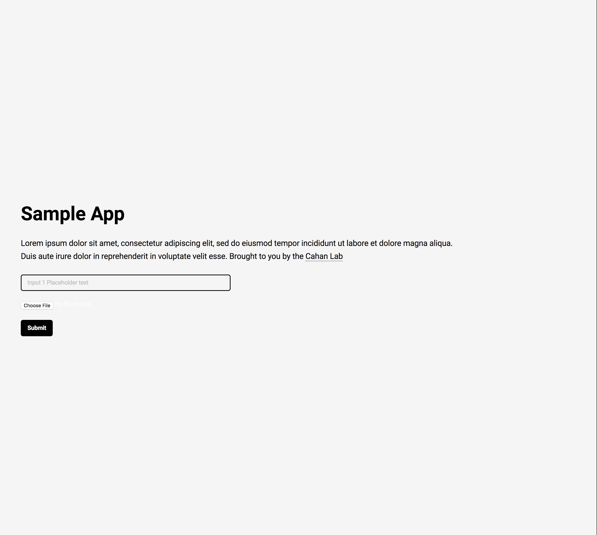
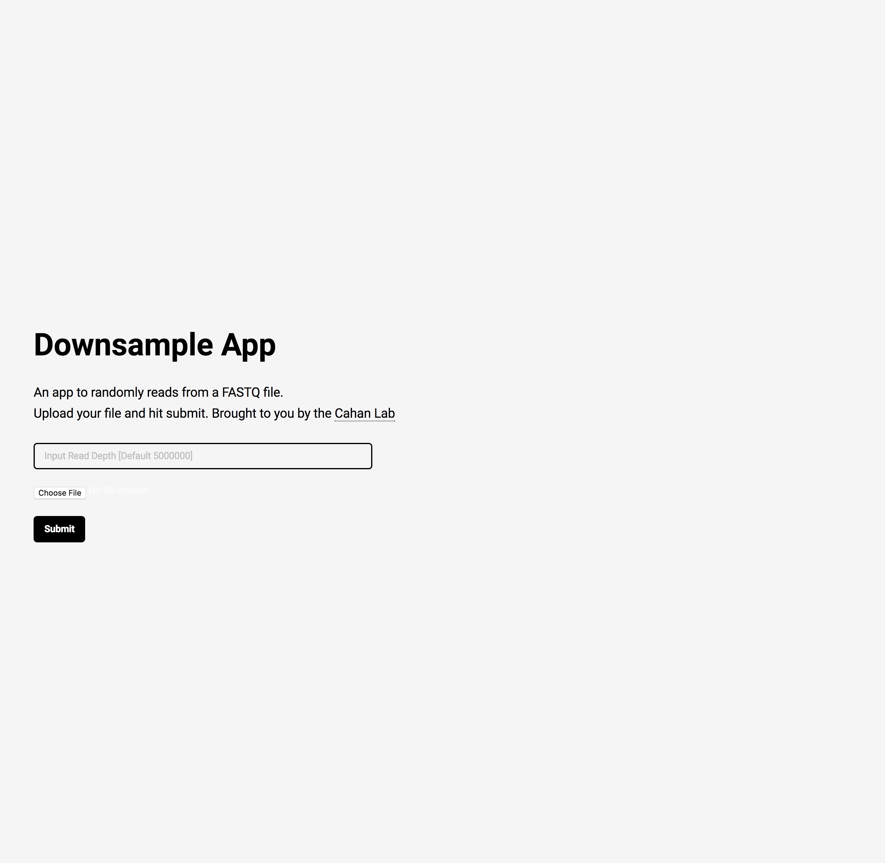

# Radiator Web Framework

Radiator is a web framework that allows you to deploy your bioinformatics command line tool through a cloud provider, facilitating flexibility, computationally efficiency, cost-effectiveness, and above all, reproducibility.

The following walkthrough assumes basic knowledge of Linux, virtual servers and machines, and web development concepts. It will demonstrate how to adapt our base framework for a simple example application.

We have written a Python 'down-sampling' script, `down.py` as an example of a bioinformatics tool one might want to deploy. The script takes a random sample of reads from a FASTQ file; this is useful when fewer reads than may be present in a FASTQ file are sufficient for a downstream analysis tool.

### Architecture Overview:
Radiator utilizes a Model-View-Controller (MVC)-like architecture. This is an organizational paradigm that separates the logic of code into the categories of front-end/user-side appearance (views), back-end/server-side software (controllers), and data (models). 

In the Radiator framework, directories are organized under the MVC paradigm as such: 
* HTML files are stored under `views` 
* Server-side scripts are stored under `controllers` 
* Data are stored under `models`
* Supporting CSS and Javascript files specifying additional front-end behaviors are found under `assets` 

These directories are stored in the server's filesystem under `/var/www/html`. 


### Launching our base framework (For the Developer):
The base virtual machine is hosted by Amazon Web Services as an EC2 Amazon Machine Image (AMI). Currently it is only available in the US-East-1 region.
1.  Select the Radiator AMI: **Cahan-Lab Application Framework Base Image** 
    * AMI ID: `ami-5dd1db27`
2.  Specify desired instance type.
3.  Specify security group. Make sure it allows for incoming traffic through ports 20 (SSH for shell access) and port 80 (HTTP for web access)
4.  Launch instance.

### The Front Page:


5. Modify the input parameters of the front page by editing `front_page.php` in `/var/www/html/views/`.
   Name your application and provide a brief description here. 
   Add HTML form elements for specifying the user parameters necessary for analysis. 
   Modify application appearance in `/var/www/html/assets/css/main.css` and `upload-file.css`.
6. For the purposes of the down-sampling application, we will add an html form element to specify the number of reads desired. 
7. Add the following HTML tag to the front page:
```html
<input type="text" name="parameter1" placeholder="Input Read Depth [Default 5000000]"/>
```
8. Now your front page should look similar to the following:



### Controllers:
9. Add your executable (in this case, the down-sampling executable) to its proper location using scp. Your command should look something like this:
    - ```scp -i keyname.pem downsample_file ec2-user@ec2-public-DNS-compute-1.amazonaws.com:/var/www/html/controllers/Algorithm```
10. Assign the proper permissions so that Apache can execute it:
    - ```sudo chown apache downsample_file``` 
    - ```sudo chmod +x downsample # This will make it appear as an executable to the operating system```

The `run.php` script takes care of the parameters specified in your front page form. It collects them to create a shell command that will feed input into your script.
So now we can build the command to execute the script. Change the line
```php
if(isset($_POST['parameter1'])) {
    $parameter1 = (int)$_POST['parameter1'];
    #$command = "/var/www/html/controllers/Algorithm/EXECUTABLE_NAME";
}
else {
    #$command = "/var/www/html/controllers/Algorithm/EXECUTABLE_NAME";
}
```

to 

```php
if (move_uploaded_file($_FILES['data']['tmp_name'], $target_file)) {
## CHECK IF A PARAMETER IS SPECIFIED
    if(isset($_POST['parameter1'])) {
        $parameter1 = (int)$_POST['parameter1'];
        $command = "/var/www/html/controllers/Algorithm/downfile -n $parameter1 $target_file";
    }
    else {
        $command = "/var/www/html/controllers/Algorithm/downfile $target_file";
    }
    exec($command);
}
```

### Setting I/O Paths:
11. Now make sure that the executable is writing its output to the right place. In your the downsample script, replace this line (LINE 40):
    ```python
    with open("subset_"+fname, "w") as output:
    ```
    with

    ```python
    with open("/var/www/html/models/output/subset_"+fname, "w") as output:
    ```
### Make Application Available through Cloud Formation:

12. Save new AMI based on current instance state.
13. Make the AMI public.
14. Map your Stack Template to launch an instance of your AMI.
15. Make the link to your Stack Template publically available. 

### Launching the Application (End-user):

This process is similar to launching the CellNet web application, detailed on the [CellNet Web Application GitHub Page](https://github.com/pcahan1/CellNet_Cloud).

16. Navigate to Cloud Formation.
17. Create Stack by pasting link to Stack Template.
18. Use the output URL to open the web application.
19. Use web application.
20. Finish and delete stack.  


### Storage
Your instance type matters! If your application is going to require more than ~5GB of disk space, then you'll want to specify an instance type with Storage Volumes. They should be automatically mounted upon instantiation.


